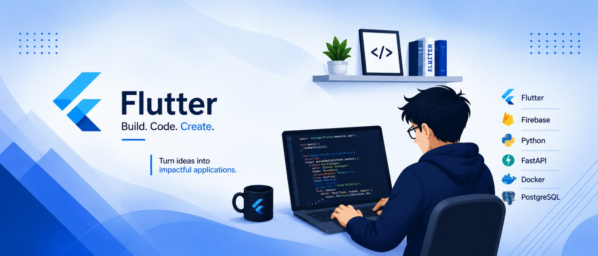

 <div align="center">

  

  <h1>👋 HI, I'M SUMIT SINGH</h1>

  <h3>📱 Flutter Developer | Mobile App Developer | Full Stack Developer</h3>

  

  <p>
    <a href="https://github.com/Sumit-singh2398">
      
    </a>
    <a href="https://www.linkedin.com/in/sumit-singh-975b7b412/">
      
    </a>
  </p>

</div>

---

## 👨‍💻 About Me

I'm **Sumit Singh**, a BCA student and Flutter Developer passionate about building modern, practical, and user-friendly applications.

My primary focus is **Flutter and Dart**, where I build Android applications with clean UI, smooth navigation, reusable components, REST API integration, authentication, and real-world functionality.

Along with mobile development, I work with **FastAPI, PostgreSQL, Firebase, REST APIs, JWT, Docker, and Git/GitHub**, which helps me understand the complete application development process.

I enjoy turning ideas into working products:

```text
Concept → UI/UX → Flutter → API → Backend → Database → Authentication → Testing → Deployment
```

My goal is to become a strong **Full Stack Mobile Developer** capable of developing complete, scalable, and production-ready applications.

---

## 🎯 What I Do

- 📱 Build Android applications using **Flutter and Dart**
- 🎨 Create modern and responsive mobile interfaces
- 🔗 Integrate REST APIs with Flutter applications
- ⚙️ Develop backend services using **FastAPI**
- 🔐 Implement authentication using **JWT and Firebase**
- 🗄️ Work with **PostgreSQL, Cloud Firestore, and Realtime Database**
- 🔄 Use **GetX** for state management
- 🧪 Test APIs using **Postman**
- 🐳 Work with **Docker** for backend environments
- 🌱 Continuously improve my development and problem-solving skills

---

# 🛠️ Tech Stack

### 📱 Mobile Development

<p>
  
</p>

`Flutter` `Dart` `Android Studio` `GetX` `Responsive UI` `State Management`

### 💻 Programming Languages

<p>
  
</p>

`Dart` `Python (Basic)` `C (Basic)`

### ⚙️ Backend Development

<p>
  
</p>

`FastAPI` `REST APIs` `JWT` `Backend Development`

### 🗄️ Database & Storage

<p>
  
</p>

`PostgreSQL` `Firebase` `Cloud Firestore` `Realtime Database`

### 🔐 Authentication

`JWT Authentication` `OAuth` `Firebase Authentication`

### ☁️ Deployment & Infrastructure

<p>
  
</p>

`Docker` `Render` `Vercel`

### 🔧 Tools

<p>
  
</p>

`Git` `GitHub` `VS Code` `Postman`

---

# 🚀 Featured Projects

## 🏢 Orgaflow — Asset Management Platform

**Orgaflow** is a mobile-based organization asset management platform designed to manage company assets, employees, requests, and asset allocation through a centralized system.

The project is being developed using a **Flutter frontend, FastAPI backend, PostgreSQL database, JWT authentication, and Docker-based backend environment**.

### 🔑 Key Features

- 👤 Employee authentication
- 🔐 JWT-based authentication and security
- 🏢 Employee and management portals
- 📦 Asset management
- 📝 Employee asset request system
- 📊 Management dashboard
- 🔄 Request tracking
- 🗄️ PostgreSQL database
- 🔗 FastAPI REST API
- 🐳 Docker backend environment
- ⚡ GetX state management

**Tech Stack:**

`Flutter` `Dart` `GetX` `FastAPI` `PostgreSQL` `JWT` `Docker` `REST API`

---

## 🏔️ Pahad Alert — Landslide Early Warning System

**Pahad Alert** is a landslide early-warning and risk-monitoring application designed for people living in or travelling through hilly and landslide-prone regions.

The project focuses on using environmental and geographical information to provide understandable risk levels and timely alerts.

### 🌧️ Key Features

- 🌧️ Rainfall condition analysis
- 🌱 Soil condition monitoring
- 🛰️ Satellite-based information
- 🗺️ Geospatial data
- 🟢 Low-risk indication
- 🟡 Medium-risk indication
- 🔴 High-risk indication
- 🚨 Mobile alerts and notifications
- 📡 Offline-friendly functionality

**Tech Stack:**

`Flutter` `Dart` `Firebase` `APIs` `Geospatial Data`

---

## 🎬 TeleShow — Movie & TV Discovery App

**TeleShow** is a Flutter-based entertainment application designed for discovering movies and TV shows using external entertainment APIs.

### 🎥 Key Features

- 🎬 Movie discovery
- 📺 TV show discovery
- 🔎 Search functionality
- ⭐ Ratings
- 🖼️ Posters and media details
- 🔗 REST API integration

**Tech Stack:**

`Flutter` `Dart` `REST API` `Movie APIs`

---

# 🏆 Achievements & Hackathon Experience

## 🥇 1. CodeQuest — 1st Position, IMS Noida

🏆 **Secured 1st Position in CodeQuest at IMS Noida.**

This achievement reflects my programming abilities, logical thinking, and problem-solving skills.

### 💡 Skills Demonstrated

- 🧠 Logical and analytical thinking
- 💻 Programming and problem-solving
- ⏱️ Working under time constraints
- 🔍 Analyzing challenges and developing solutions
- 🚀 Continuous improvement in coding skills

---

## 🥈 2. Internal Smart India Hackathon — 2nd Position, IMS Noida

🏆 **Secured 2nd Position among 20+ participating teams.**

**Team:** Stack Sprinters

Participated in the internal Smart India Hackathon at IMS Noida, where our team worked on a real-world problem statement and developed a proposed technical solution.

### 💡 Experience Gained

- 🧠 Problem statement analysis
- 💡 Solution design and planning
- 👥 Team collaboration
- 🎨 Product presentation
- 🛠️ Rapid prototyping
- 🎤 Pitching technical ideas
- ⏱️ Working under hackathon deadlines

This experience strengthened my ability to collaborate with a team, turn ideas into practical solutions, and present technical concepts.

---

## 🤖 3. IBM Bob Hackathon 2.0 — Participation

**Project:** ThreatLens AI  
**Team:** ThreatLens AI - Hunters Algorithm

Participated in the **IBM Bob Hackathon 2.0**, a 48-hour online hackathon focused on building innovative solutions.

Our project, **ThreatLens AI**, focused on AI-powered cybersecurity threat detection and investigation.

### 🔐 About ThreatLens AI

ThreatLens AI is designed to analyze security logs and identify potentially suspicious activities using machine learning and security analytics.

### 🔍 Project Workflow

```text
Security Logs
     ↓
Data Cleaning
     ↓
Feature Extraction
     ↓
Anomaly Detection
     ↓
Threat Classification
     ↓
Risk Scoring
     ↓
Explainable Investigation
     ↓
Security Dashboard
```

### 🚨 Threats Considered

- 🔑 Brute-force login attempts
- 🌐 Port scanning
- 👤 Abnormal login behavior
- 🚩 Suspicious IP activity
- ⚠️ High-risk events

### 🧠 Skills & Experience Gained

- 🤖 AI/ML-based problem-solving
- 🔐 Cybersecurity fundamentals
- 📊 Log analysis
- 🧠 Anomaly detection
- 👥 Team collaboration
- 🎤 Technical presentation
- ⚡ Rapid development under a 48-hour deadline

📜 **IBM Bob Hackathon 2.0 Participation Certificate Received**

---

# 🏅 Certifications & Recognition

1. 🥇 **1st Position — CodeQuest, IMS Noida**
2. 🥈 **2nd Position — Internal Smart India Hackathon, IMS Noida**
3. 🤖 **IBM Bob Hackathon 2.0 — Participation Certificate**
4. 📜 **Flutter Development Certificate — Simplilearn**
5. 💻 **Multiple Academic & Personal Software Development Projects**

---

# 💼 Development Experience

### 📱 Flutter & Mobile Development

Hands-on project experience building Android applications using Flutter, including:

- UI development
- Navigation and reusable components
- Forms and validation
- REST API integration
- Authentication
- State management
- Firebase integration
- Debugging
- Application architecture

### ⚙️ Backend Development

Practical project work involving:

- FastAPI
- REST API development and integration
- JWT authentication
- PostgreSQL
- Database relationships
- API testing with Postman
- Docker-based environments

### 🤝 Teamwork & Hackathons

My hackathon experiences have helped me understand the complete process of building and presenting software solutions.

```text
Problem Understanding
        ↓
Research
        ↓
Solution Design
        ↓
Development
        ↓
Testing
        ↓
Presentation
        ↓
Team Collaboration
```

---

# 🌱 Currently Learning

- 📱 Advanced Flutter Development
- 🏗️ Flutter Architecture and Best Practices
- ⚙️ FastAPI and Backend Development
- 🗄️ PostgreSQL and Database Design
- 🔐 Authentication and API Security
- 🐳 Docker and Cloud Deployment
- 🤖 Artificial Intelligence and Machine Learning
- 🔗 AI integration with mobile applications

---

# 🧠 Development Approach

```text
IDEA
  ↓
RESEARCH
  ↓
PROBLEM ANALYSIS
  ↓
UI/UX DESIGN
  ↓
FLUTTER DEVELOPMENT
  ↓
API INTEGRATION
  ↓
BACKEND DEVELOPMENT
  ↓
DATABASE DESIGN
  ↓
AUTHENTICATION
  ↓
TESTING & DEBUGGING
  ↓
DEPLOYMENT
```

I believe good software is not only about writing code. It is about **understanding the problem, designing the right solution, building it properly, and continuously improving it.**

---

# 📊 GitHub Statistics

<p align="center">
  
</p>

<p align="center">
  
</p>

<p align="center">
  
</p>

---

# 🎯 Career Goal

I am working toward becoming a **Full Stack Mobile Developer** who can independently build complete applications, from frontend and backend to databases, authentication, APIs, and deployment.

I am especially interested in opportunities where I can:

- 📱 Build real-world Flutter applications
- ⚙️ Work with backend APIs
- 🗄️ Design and work with databases
- 🤖 Explore AI-powered applications
- 🚀 Contribute to production-level products
- 📚 Learn from experienced developers

---

# 🤝 Let's Connect

<p align="center">
  <a href="https://github.com/Sumit-singh2398">
    
  </a>
  <a href="https://www.linkedin.com/in/sumit-singh-975b7b412/">
    
  </a>
</p>

<p align="center">
  <strong>💻 Code. Build. Break. Fix. Repeat. </strong>
</p>
